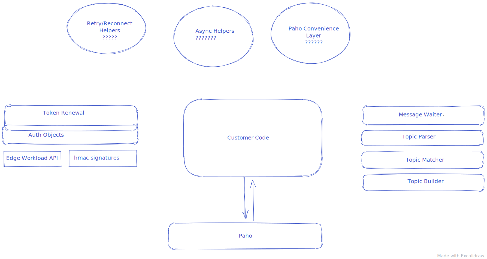

# Architecture Principles

1. We're building "helpers", not a framework.
2. No direct dependencies on the transport.  If any of our helper code needs to include transport code, we've failed.
3. Helpers should be as independent as possible.  Customers should be able to chose components a-la-carte.

# The picture

* Customer code calls Paho directly
* This means extra boilerplate code for customers.  We can make this better later by adding "convenience layers"

* 3 topic helpers (on right) have no dependencies on Paho.  They are string manipulation objects.
* Message Waiters (on right) are tied to topic helpers. They are not tied to Paho, but they make Paho easier to use.

* Auth objects (on left) are used to get MQTT connect args.
* Auth objects are not tied to Paho.
* SAS renewal code is very simple.  Relies on customer plumbing.

* 3 circles at top are missing code that we may want to add later.

# The tours

To explore this code, use the [Visual Studio Code CodeTour Extension](https://marketplace.visualstudio.com/items?itemName=vsls-contrib.codetour).  You will find various tours in the outline pane of VS Code.

# Code that is still missing 

* testing of new topic format
* status code mapping for twin ops
* digital twin helpers.  I'm not sure of the scope here. 
* add user agent strings
* samples for identity translation
* distribution plans.  Use pypi/npm, curl-based distribution, or include the helpers with every sample (not recommended)

# Code that is out-of-scope
* x509 auth helper
* DPS helpers for device/module registration
* async helpers (waitable objects and some auth functionality)
* Paho convenience layers, both callback-based and async.  
* async workload API interface
* more complete workload API interface
* Any significant failure handling, reconnect, and retry code in the samples.  
* reconnect/retry helpers (probably tied to the Paho convenience layer(s))
* plans for track 2 SDK and/or iothub broker
* specific property maps (valid names and correct encoding for track 2 iothub mqtt)

# What happens next:
* Review of general API shape with various teams (scripting SDK, edge, other langauge SDks)
* Review of sample organization
* Decision for how PNP fits in with this
* Agreement on "out of scope" list above
* Plans for "still missing" list above
* Finalization of this code

